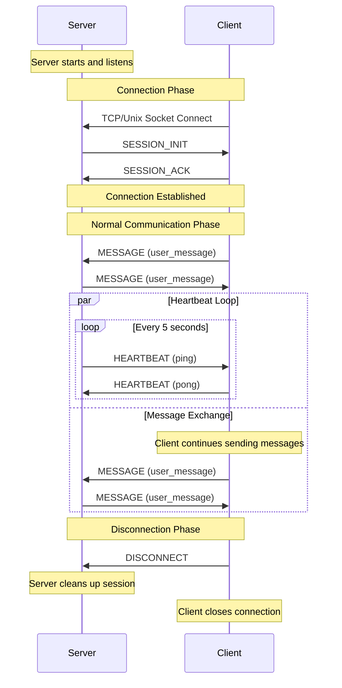

# Async Socket Chat

A demonstration of asynchronous socket-based client-server communication supporting both TCP and Unix sockets, with enhanced message handling and session management.

## Features

- Supports both TCP and Unix socket communication
- Multiple client connection modes (interactive CLI and file-based input)
- Robust message protocol with encryption and integrity checks
- Session management with heartbeat monitoring
- Asynchronous I/O using Python's asyncio
- Extensible base classes for custom implementations

## Architecture

### Core Components

- **Message Protocol**: Enhanced binary protocol with CRC32 checksums and HMAC authentication
- **Session Management**: UUID-based session tracking with heartbeat monitoring
- **Base Classes**: Abstract implementations for server, client, and session management
- **Interface Definitions**: Clear contract definitions through abstract base classes

### Message Types

- SESSION_INIT/ACK: Session establishment
- HEARTBEAT: Connection health monitoring
- MESSAGE: Regular communication
- ERROR: Error notifications
- DISCONNECT: Clean session termination

## Installation

```bash
pip install -r requirements.txt
```

The server will handle all client interactions concurrently, maintaining separate sessions for each connection.

## Usage

### Starting the Server

TCP Server:
```bash
python tcp_server.py [host] [port]
# Default: localhost:9999
```

Unix Socket Server:
```bash
python unix_server.py [socket_path]
# Default: /tmp/chat.sock
```

### Running Clients

#### TCP Client

Interactive Mode:
```bash
python tcp_client.py interactive [host] [port]
```

File Input Mode:
```bash
python tcp_client.py file messages.txt [host] [port]
```

#### Unix Socket Client

Interactive Mode:
```bash
python unix_client.py interactive [socket_path]
```

File Input Mode:
```bash
python unix_client.py file messages.txt [socket_path]
```

### Client Commands

- Type messages and press Enter to send
- Type 'exit' to close connection
- Ctrl+C to force quit

### Concurrent Client Support

Both TCP and Unix socket servers support multiple simultaneous client connections. To demonstrate:

1. Start the server (TCP or Unix socket)
2. Run multiple clients simultaneously:
```bash
# Terminal 1
python tcp_client.py file messages.txt

# Terminal 2 
python tcp_client.py file messages2.txt

# Terminal 3 (optional)
python tcp_client.py interactive
```

### Diagram



## Protocol Details

The message protocol includes:
- 8-byte magic number
- 2-byte version
- 2-byte message type
- Header length and CRC32
- Content length and CRC32
- HMAC-SHA256 authentication
- JSON-encoded headers
- Binary message content

## Integration Guide

### Using in Your Project

1. Core Module Integration:
```python
from message import EnhancedMessageHandler, Message
from base_server import BaseServer
from base_client import BaseAsyncClient
from session import BaseSession
```

2. Implement Custom Communication:
```python
class MyCustomServer(BaseServer):
    async def process_message(self, session: ISession, message: Message) -> None:
        # Custom business logic
        response = process_business_logic(message.content)
        await self.send_message(session, response)

class MyCustomClient(BaseAsyncClient):
    async def start(self, message_source: str) -> None:
        # Custom startup logic
        await self.connect()
        await self.custom_message_handling()
```

3. Message Protocol Usage:
```python
# Server-side message handling
handler = EnhancedMessageHandler(hmac_key=b'your-secret-key')
message = Message.from_dict({
    'type': MessageType.MESSAGE,
    'content': your_data,
    'content_type': 'application/json'
})
encoded = handler.encode_message(message)
```

4. Session Management:
```python
class CustomSession(BaseSession):
    def __init__(self, session_id: str, writer: asyncio.StreamWriter):
        super().__init__(session_id, writer)
        self.add_extra_info('custom_data', {})
        
    async def custom_cleanup(self):
        # Custom cleanup logic
        await self.close()
```

### Key Integration Points

1. **Message Protocol**: Use `message.py` for robust message encoding/decoding
2. **Session Management**: Extend `BaseSession` for custom session handling
3. **Server Implementation**: Inherit `BaseServer` for custom server logic
4. **Client Implementation**: Extend `BaseAsyncClient` for custom client behavior

### Best Practices

- Maintain heartbeat mechanisms for connection health
- Handle session cleanup properly
- Use the message protocol's security features (HMAC, CRC32)
- Implement proper error handling and logging
- Consider implementing retry mechanisms for critical operations

## Development

### Project Structure

```
├── base_client.py     # Abstract client implementation
├── base_server.py     # Abstract server implementation
├── message.py         # Message protocol implementation
├── session.py         # Session management
├── tcp_client.py      # TCP client implementation
├── tcp_server.py      # TCP server implementation
├── unix_client.py     # Unix socket client
└── unix_server.py     # Unix socket server
```

### Extending the System

1. Create custom session types:
```python
class CustomSession(BaseSession):
    def __init__(self, session_id: str, writer: asyncio.StreamWriter):
        super().__init__(session_id, writer)
        # Add custom initialization
```

2. Implement custom servers:
```python
class CustomServer(BaseServer):
    async def process_message(self, session: ISession, message: Message) -> None:
        # Custom message handling
```

## Testing

### 测试架构

1. 基础结构：
- 使用 pytest 和 pytest-asyncio 进行异步测试
- 提供了 ServerWrapper 类来管理服务器生命周期
- 提供了查找可用 TCP 端口和临时 Unix 套接字路径的辅助函数
- 使用夹具来管理事件循环、服务器和客户端的生命周期

2. 测试类层次：
```
BaseServerTests
├── TestTCPServer
│   ├── test_tcp_specific_feature
│   └── (继承的通用测试)
└── TestUnixServer
    ├── test_socket_file_cleanup
    └── (继承的通用测试)
```

3. 主要测试用例：
- 基本连接测试：验证客户端连接和断开
- 心跳机制测试：使用单次心跳进行精确测试
- 消息收发测试：验证消息的发送和接收
- 会话管理测试：验证会话的创建和清理
- 并发和性能测试：使用基准测试进行压力测试

### 使用方法

1. 安装依赖：
```bash
pip install pytest pytest-asyncio pytest-benchmark
```

2. 运行测试：
```bash
# 运行所有测试
pytest test_socket_chat.py -v

# 运行 TCP 测试
pytest test_socket_chat.py -v -k TCP

# 运行 Unix 套接字测试
pytest test_socket_chat.py -v -k Unix

# 运行性能测试
pytest test_socket_chat.py -v -m benchmark
```

### 服务器包装器

ServerWrapper 类用于管理服务器的生命周期：
```python
async with ServerWrapper(server) as wrapper:
    # 服务器已启动
    await do_something()
    # 自动清理资源
```

特点：
- 非阻塞服务器启动
- 自动资源清理
- 支持 TCP 和 Unix 套接字服务器
- 异常情况的优雅处理

### 测试辅助工具

1. 会话等待工具：
```python
async def wait_for_session_active(self, server, client, timeout=1.0):
    """等待直到会话被创建并激活"""
    # ...
```

2. 客户端心跳工具：
```python
async def send_single_heartbeat(self):
    """发送单次心跳包，用于精确测试"""
    # ...
```

3. 并发测试辅助：
```python
async def wait_for_client_connect(self, client, timeout=2.0):
    """等待客户端连接成功"""
    # ...
```

### 性能测试说明

1. 并发客户端测试：
- 使用分批连接避免连接风暴
- 支持可配置的并发数和超时时间
- 提供连接和消息吞吐量指标

2. 消息吞吐量测试：
- 大消息测试（1MB）
- 小消息高频测试（1000条）
- 支持自定义消息大小和频率

### 性能测试说明

1. 基准测试设置：
```bash
# 运行所有基准测试
pytest test_socket_chat.py -v -m benchmark

# 运行特定基准测试
pytest test_socket_chat.py -v -k test_large_message_throughput

# 输出详细的基准报告
pytest test_socket_chat.py --benchmark-only --benchmark-json=output.json
```

2. 基准测试指标：
- 操作延迟（min/max/mean）
- 吞吐量（ops/sec）
- 标准差和分布
- CPU 和内存使用情况

3. 测试场景：
- 并发客户端：5个客户端，分批连接
- 大消息传输：100KB消息块
- 小消息高频：每批100条小消息

4. 性能优化建议：
- 调整分块大小（CHUNK_SIZE）
- 修改并发客户端数量
- 配置发送频率控制

### 注意事项

1. 资源管理：
- 测试结束时确保清理所有资源
- 使用 pytest 夹具管理生命周期
- 合理设置超时和重试次数

2. 异步测试：
- 所有异步夹具使用 @pytest_asyncio.fixture
- 正确处理事件循环和任务取消
- 避免测试间的资源竞争

3. 并发测试：
- 合理设置并发数避免资源耗尽
- 使用分批处理避免连接风暴
- 注意清理所有异步任务

## License

This project is licensed under the GNU Affero General Public License v3.0 (AGPL-3.0)