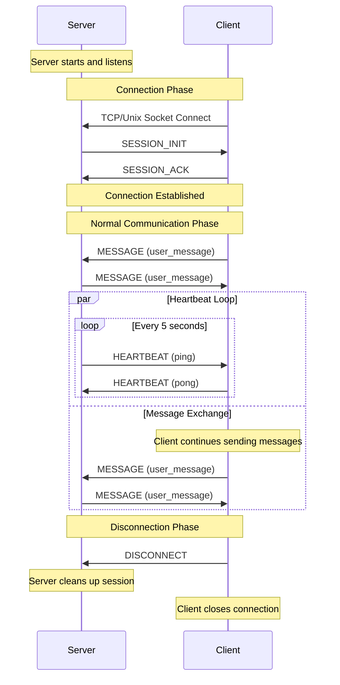

# Async Socket Chat

A demonstration of asynchronous socket-based client-server communication supporting both TCP and Unix sockets, with enhanced message handling and session management.

## Features

- Supports both TCP and Unix socket communication
- Multiple client connection modes (interactive CLI and file-based input)
- Robust message protocol with CRC32 checksums and HMAC authentication
- Session management with heartbeat monitoring
- Asynchronous I/O using Python's asyncio
- Extensible base classes for custom implementations
- Support for large message chunking and streaming
- Comprehensive error handling and retry mechanisms
- Support for both text and binary message content

## Architecture

### Core Components

- **Message Protocol**: Enhanced binary protocol with:
  - 8-byte magic number
  - 2-byte version number
  - 2-byte message type
  - Header length and CRC32 checksum
  - Content length and CRC32 checksum
  - HMAC-SHA256 authentication
  - JSON-encoded headers
  - Support for both text and binary content
  - Chunk-based transmission for large messages

- **Session Management**: 
  - UUID-based session tracking
  - Heartbeat monitoring (5-second intervals by default)
  - Extra information storage capability per session
  - Automatic session cleanup on timeout

- **Base Classes**: 
  - IServer: Server interface definition
  - IClient: Client interface definition
  - ISession: Session interface definition
  - BaseServer: Abstract server implementation
  - BaseAsyncClient: Abstract client implementation
  - BaseSession: Base session implementation

### Message Types

- SESSION_INIT/ACK: Session establishment
- HEARTBEAT: Connection health monitoring (ping/pong)
- MESSAGE: Regular communication
- CHUNK: Large message transmission
- ERROR: Error notifications
- DISCONNECT: Clean session termination

## Installation

```bash
pip install -r requirements.txt
```

Required packages:
- aioconsole~=0.8.1
- pytest~=8.3.4
- pytest-asyncio~=0.25.0
- pytest-benchmark~=5.1.0

## Usage

### Starting the Server

TCP Server:
```bash
python tcp_server.py [host] [port]
# Default: localhost:9999
```

Unix Socket Server:
```bash
python unix_server.py [socket_path]
# Default: /tmp/chat.sock
```

### Running Clients

#### TCP Client

Interactive Mode:
```bash
python tcp_client.py interactive [host] [port]
```

File Input Mode:
```bash
python tcp_client.py file messages.txt [host] [port]
```

#### Unix Socket Client

Interactive Mode:
```bash
python unix_client.py interactive [socket_path]
```

File Input Mode:
```bash
python unix_client.py file messages.txt [socket_path]
```

### Client Commands

- Type messages and press Enter to send
- Type 'exit' to close connection
- Ctrl+C to force quit
- Messages are automatically chunked if they exceed 8KB
- UTF-8 encoding is supported by default

### Concurrent Client Support

Both TCP and Unix socket servers support multiple simultaneous client connections. To demonstrate:

1. Start the server (TCP or Unix socket)
2. Run multiple clients simultaneously:
```bash
# Terminal 1
python tcp_client.py file messages.txt

# Terminal 2 
python tcp_client.py file messages2.txt

# Terminal 3 (optional)
python tcp_client.py interactive
```

### Diagram



## Protocol Details

The message protocol includes:
- **Header Structure**:
  - 8-byte magic number (unique identifier)
  - 2-byte version number
  - 2-byte message type
  - 4-byte header length
  - 4-byte header CRC32
  - 8-byte content length
  - 4-byte content CRC32
  - 32-byte HMAC-SHA256 digest
- **Size Limits**:
  - Maximum header size: 64KB
  - Maximum content size: 10MB
  - Default chunk size: 8KB
- **Security Features**:
  - CRC32 checksums for both header and content
  - HMAC-SHA256 authentication
  - Version checking
  - Magic number validation

## Integration Guide

### Using in Your Project

1. Core Module Integration:
```python
from message import EnhancedMessageHandler, Message, MessageType
from base_server import BaseServer
from base_client import BaseAsyncClient
from session import BaseSession
```

2. Implement Custom Communication:
```python
class MyCustomServer(BaseServer):
    async def process_message(self, session: ISession, message: Message) -> None:
        # Custom message handling
        await self.send_message(session, response)

class MyCustomClient(BaseAsyncClient):
    async def start(self, message_source: str) -> None:
        await self.connect()
        await self.process_messages()
```

3. Session Management:
```python
class CustomSession(BaseSession):
    def __init__(self, session_id: str, writer: asyncio.StreamWriter):
        super().__init__(session_id, writer)
        self.add_extra_info('custom_data', {})
        
    async def close(self):
        # Custom cleanup logic
        await super().close()
```

### Best Practices

- Use heartbeat mechanisms for connection health monitoring (default: 5-second interval)
- Implement proper session cleanup
- Utilize the message protocol's security features
- Handle chunked messages for large data transfers
- Implement proper error handling and logging
- Consider retry mechanisms for critical operations
- Use UTF-8 encoding for text messages
- Handle connection timeouts appropriately

## Testing

Run the test suite:
```bash
# Run all tests
pytest test_socket_chat.py -v

# Run specific test categories
pytest test_socket_chat.py -v -k TCP
pytest test_socket_chat.py -v -k Unix
pytest test_socket_chat.py -v -m benchmark

# or
pytest test_socket_chat.py --benchmark-only --benchmark-json=benchmark_results.json
python -c "from test_socket_chat import visualize_benchmark_results; visualize_benchmark_results('benchmark_results.json')"
```

Key test areas:
- Basic connectivity
- Message protocol integrity
- Session management
- Concurrent connections
- Large message handling
- Performance benchmarks

## License

This project is licensed under the GNU Affero General Public License v3.0 (AGPL-3.0)