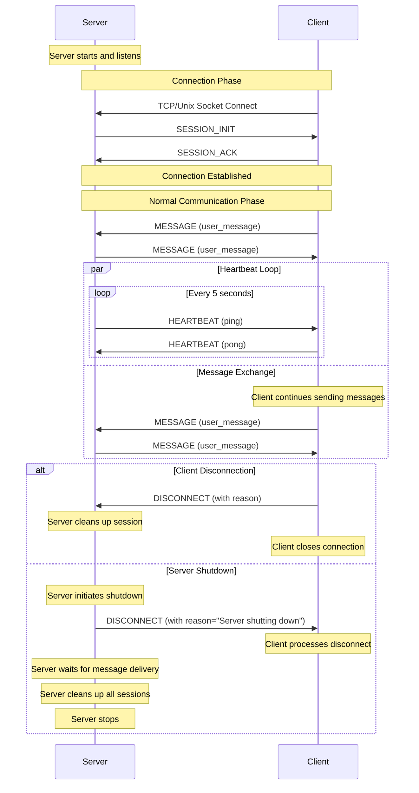

# Async Socket Chat

A demonstration of asynchronous socket-based client-server communication supporting both TCP and Unix sockets, with enhanced message handling and session management.

## Features

- Supports both TCP and Unix socket communication
- Multiple client connection modes (interactive CLI and file-based input)
- Robust message protocol with CRC32 checksums and HMAC authentication
- Session management with heartbeat monitoring
- Graceful server shutdown with client notification
- Asynchronous I/O using Python's asyncio
- Extensible base classes for custom implementations
- Support for large message chunking and streaming
- Comprehensive error handling and retry mechanisms
- Support for both text and binary message content
- JSON-encoded control messages for richer metadata

## Architecture

### Core Components

- **Message Protocol**: Enhanced binary protocol with:
  - 8-byte magic number
  - 2-byte version number
  - 2-byte message type
  - Header length and CRC32 checksum
  - Content length and CRC32 checksum
  - HMAC-SHA256 authentication
  - JSON-encoded headers
  - Support for both text and binary content
  - Chunk-based transmission for large messages

- **Session Management**: 
  - UUID-based session tracking
  - Heartbeat monitoring (5-second intervals by default)
  - Extra information storage capability per session
  - Automatic session cleanup on timeout
  - Graceful session termination with reason reporting

- **Base Classes**: 
  - IServer: Server interface definition
  - IClient: Client interface definition
  - ISession: Session interface definition
  - BaseServer: Abstract server implementation
  - BaseAsyncClient: Abstract client implementation
  - BaseSession: Base session implementation

### Message Types

- SESSION_INIT/ACK: Session establishment
- HEARTBEAT: Connection health monitoring (ping/pong)
- MESSAGE: Regular communication
- CHUNK: Large message transmission
- ERROR: Error notifications
- DISCONNECT: Clean session termination with reason

## Installation

```bash
pip install -r requirements.txt
```

Required packages:
- aioconsole~=0.8.1
- pytest~=8.3.4
- pytest-asyncio~=0.25.0
- pytest-benchmark~=5.1.0

## Communication Flow



## Usage

### Starting the Server

TCP Server:
```bash
python tcp_server.py [host] [port]
# Default: localhost:9999
```

Unix Socket Server:
```bash
python unix_server.py [socket_path]
# Default: /tmp/chat.sock
```

### Running Clients

#### TCP Client

Interactive Mode:
```bash
python tcp_client.py interactive [host] [port]
```

File Input Mode:
```bash
python tcp_client.py file messages.txt [host] [port]
```

#### Unix Socket Client

Interactive Mode:
```bash
python unix_client.py interactive [socket_path]
```

File Input Mode:
```bash
python unix_client.py file messages.txt [socket_path]
```

### Client Commands

- Type messages and press Enter to send
- Type 'exit' to close connection
- Ctrl+C to force quit
- Messages are automatically chunked if they exceed 8KB
- UTF-8 encoding is supported by default

### Server Shutdown

The server supports graceful shutdown, which:
1. Sends disconnect messages to all connected clients
2. Waits for message delivery
3. Cleans up all active sessions
4. Removes socket files (Unix sockets)

When the server shuts down:
- All clients receive a disconnect message with reason "Server shutting down"
- Clients automatically close their connections
- All resources are properly cleaned up

## Integration Guide

### Using in Your Project

1. Core Module Integration:
```python
from message import EnhancedMessageHandler, Message, MessageType, PresetMessages
from base_server import BaseServer
from base_client import BaseAsyncClient
from session import BaseSession
```

2. Implementing a Custom Server:
```python
class MyCustomServer(BaseServer):
    def __init__(self, host: str, port: int):
        super().__init__(MyCustomSession)
        self.host = host
        self.port = port
    
    async def process_message(self, session: ISession, message: Message) -> None:
        # Custom message handling logic
        if message.type == MessageType.MESSAGE.value:
            # Process the message
            response = PresetMessages.user_message(
                processed_content,
                session.session_id
            )
            await self.send_message(session, response)
    
    async def start_server(self) -> None:
        self._server = await asyncio.start_server(
            self.handle_client,
            self.host,
            self.port
        )
```

3. Implementing a Custom Client:
```python
class MyCustomClient(BaseAsyncClient):
    async def connect(self) -> bool:
        try:
            self.reader, self.writer = await asyncio.open_connection(
                self.host, self.port
            )
            # Handle session initialization
            return await self._handle_handshake(init_data)
        except Exception as e:
            print(f"Connection failed: {e}")
            return False

    async def process_message(self, message: Message) -> None:
        # Custom message processing
        if message.content_type == 'application/json':
            data = json.loads(message.content.decode('utf-8'))
            # Process JSON data
```

4. Handling Server Shutdown:
```python
class MyApplication:
    def __init__(self):
        self.server = MyCustomServer('localhost', 9999)
    
    async def run(self):
        try:
            await self.server.start()
        except KeyboardInterrupt:
            print("Initiating graceful shutdown...")
            await self.server.stop()
    
    async def shutdown(self):
        await self.server.stop()  # This will notify all clients
```

### Best Practices

1. Message Handling:
   - Always validate message format and content
   - Use appropriate content types
   - Handle all possible message types
   - Implement proper error handling

2. Session Management:
   - Maintain session state correctly
   - Clean up sessions properly
   - Handle disconnections gracefully
   - Implement heartbeat mechanism

3. Error Handling:
   - Catch and handle network errors
   - Implement retry mechanisms
   - Log errors appropriately
   - Provide meaningful error messages

4. Resource Management:
   - Clean up resources in finally blocks
   - Implement proper shutdown procedures
   - Handle SIGTERM and SIGINT signals
   - Close connections properly

## Testing

### Running Tests

```bash
# Run all tests
pytest test_socket_chat.py -v

# Run specific test categories
pytest test_socket_chat.py -v -k TCP
pytest test_socket_chat.py -v -k Unix
pytest test_socket_chat.py -v -k shutdown
pytest test_socket_chat.py -v -m benchmark

# Generate and visualize benchmarks
pytest test_socket_chat.py --benchmark-only --benchmark-json=benchmark_results.json
python -c "from test_socket_chat import visualize_benchmark_results; visualize_benchmark_results('benchmark_results.json')"
```

### Test Categories

1. Basic Functionality Tests:
   - Connection establishment
   - Message exchange
   - Session management
   - Heartbeat mechanism
   - Client disconnection
   - Server shutdown

2. Error Handling Tests:
   - Network failures
   - Invalid messages
   - Session timeouts
   - Connection losses

3. Performance Tests:
   - Message throughput
   - Concurrent connections
   - Large message handling
   - Connection/disconnection rates

### Writing Custom Tests

```python
class TestCustomServer(BaseServerTests):
    @pytest_asyncio.fixture
    async def get_server(self):
        return MyCustomServer()
    
    @pytest.mark.asyncio
    async def test_custom_feature(self, get_server, get_client):
        server = get_server
        client = get_client
        
        await client.connect()
        assert await self.wait_for_session_active(server, client)
        
        # Test your custom feature
        await client.send_message("test")
        # Assert expected behavior
```

## License

This project is licensed under the GNU Affero General Public License v3.0 (AGPL-3.0)